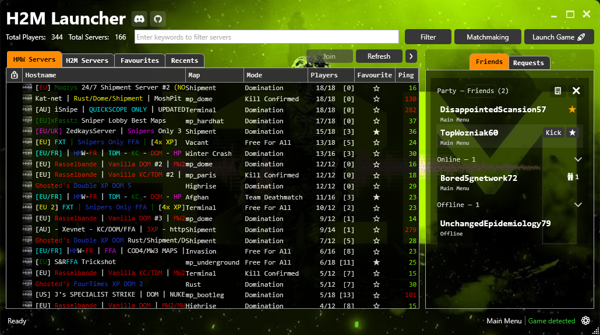

# HMW Hub: Queue, Party, Connect (formerly H2M-Launcher)

**This launcher aims to provide features like server queueing, friends and party system to HorizonMW. The project originally started out to address some issues of the in-game server browser in the legacy H2M.**

[](https://github.com/Bowhza/H2M-Launcher/releases)


### **Discord for HMW Hub**

**Join if you want to stay up-to-date with the launcher, have questions, suggestions, or looking for people to play HMW with.**

[](https://discord.com/invite/NeBYKxq5Ru)


## Features

**Table of Contents**

- [Server Browser](#server-browser)
- [Matchmaking](#matchmaking)
- [Server Queueing](#server-queueing)
- [Party System](#party-system)
- [Add Friends](#add-friends)
- [Game Detection](#game-detection)
- [Customization & Theming](#customization--theming)
- [Settings & Other](#settings--other)

### Server Browser

- Launch HorizonMW.
- Displays the server count and the total players.
- Join other servers without having to disconnect first.
- Sort servers by **name, map, mode, player count, and ping**.
- **Additional filter options:**
  - View empty, full, or private servers.
  - Minimum and maximum players.
  - Maximum server slots.
  - Map packs (MWR, MW2, MW2CR, Etc...)
  - Gamemodes.
  - Maximum Ping.
  - Filter out any keywords from the hostname, for instance, "trickshot" to filter out trickshot servers.
- Add servers to favourites and view recently played servers.
- Support for private servers, you can enter the password from the launcher.
- Reconnect to last server shortcut (see [Shortcuts](#shortcuts)).
- Game overlay (see [Shortcuts](#shortcuts)).


### Matchmaking

- Search preferences for the matchmaking.
- Centralized server for queueing.
- Predefined playlist(s) of "trusted" servers.
- Provides a list of privileged slots for servers.


### Server Queueing

- Global player queues for full servers.
- See your position and how many players are in the queue.
- Takes privileged slots into account (Currently manually configured, request more servers to be supported!)
- Ability to force join without leaving the queue if it fails.
- Join the queue while playing on another server and automatically connect when the slot is free.
- Queue together


### Party System

- Invite your friends to join the party by copying the party ID or sending them an invite. 
- The party leader controls the session for everyone.
- Supports Joining, [Queueing](#server-queueing) and [Matchmaking](#matchmaking).
- Ability to kick members or promote someone to party leader.
- Change the **Party Privacy** to control who can join your party:

    

  - **Open**: Everyone who has the id can join
  - **Friends**: Only friends can join
  - **Closed**: Only users that are invitied can join





### Add Friends

Each user gets assigned a randomly generated user name on first connection to the hub. The user is tied to a key stored locally. Create a party to find out your user name or id and share it with your friends:


There are two ways to add friends to your friends list:
- You can add friends from the party

  

- Or you can search for their user name or ID

  

Pending friend requests will appear in the **Requests** tab and can be accepted or rejected.
> **NOTE:** *After rejecting a friend request they can not send you further requests. So if you accidentally rejected someone, you'll have to send them a friend request.*

### Game Detection

- Detect whether the game is running.
- Detect whether the player is in the menu or connected to a server.
- Automatically set the game location if unset in settings and the game is detected.

### Customization & Theming


- Select a custom background image or video.
- Switch between different themes.
- Import theme packs (zip files) made by other users.
- See the [Theming guide](documentation/Theming.md) for how to create themes.

### Settings & Other

- Auto-Updater **(Click on the new version available text to download latest release).**
- Settings menu to set the master server URL or set the directory of the HMW-Mod Executable.
- Toggle game communication and server queueing.
- Change key bindings for reconnect and refresh.


## Instructions

1. Download the latest release from **[HERE](https://github.com/Bowhza/H2M-Launcher/releases)**.

2. Paste the `H2M-Launcher.UI.exe` inside the root of the game directory and run it.


- **If you want to store the launcher elsewhere**, you can set the path to the `hmw-mod.exe` in the settings or start the game so it can be detected.
- Click the settings icon in the bottom right corner of the launcher, and you should see the `Game Location` option that you can change.


1. Before using the server browser make sure HMW is running. You can press `Launch Game` to run the game.

2. Find a server you want to play on, select it, and press the join button. The HMW window should automatically be set as the foreground window.

## Shortcuts

| Keyboard/Mouse    | Description                              |
| :---------------- | :--------------------------------------- |
| `ESC`             | Close the HMW Hub.                       |
| `TAB`             | Navigate between launcher controls.      |
| `F5`              | Refresh the server list.                 |
| `ENTER`           | Join the selected server.                |
| `Right Click`     | Copies the server to clipboard.          |
| `CTRL + S`        | Save the server list to favourties.json  |
| `CTRL + ALT + R`  | Reconnect to server. (Can be changed)    |
| `CTRL + ALT + D`  | Disconnect from server. (Can be changed) |
| `SHIFT + ALT + S` | Toggle game overlay. (Can be changed)    |

## FAQ

This section will try to address most common issues people may encouter while using the browser. **The FAQ will be regurarly updated** while receiving feedback. **_Please read through this section before creating an issue_**.

### 1. Log Files

The log files can be found in the following directory: `%localappdata%\BetterH2MLauncher`

Fastest way to access the directory is by pressing `Win + R` to open the run menu and paste the directory in the `Open` text box.

### 2. Cannot connect to server or launcher does nothing when pressing join.

**Answer**: Either the server is not running or you need to change one or more windows settings.

- If you are on Windows 11, you need to change your default terminal to `Windows Console Host`. This is found under `Settings > System > For Developers`. Make sure to restart your game after changing the terminal.


- If the above does not apply to you or it still does not send a connect command, you may need to add/change your keyboard layout to `English US`.

### 3. The launcher opens but does not display any servers.

**Answer**: Open the [Server List](https://master.iw4.zip/servers#) or [API Link](https://master.iw4.zip/instance/) in your browser and see if you are able to reach the domain. If not, then check if your ISP or firewall is blocking you from accessing the domain.
Alternatively, you can try switching to the alternative master server `http://api.raidmax.org:5000`.

### 4. Why is a specific server not showing up in the list?

**Answer**: The launcher only displays servers that are actually running. Many servers in the IW4MAdmin-Master Panel are offline and reporting false stats.

- Make sure that the server reports an IPv4 Address to the panel, as IPv6 servers are not supported and will not show up.

> [!NOTE]
> **If you and others can connect to the server in game, but it does not show up, please report the concrete case!**

### 5. Saving to clipboard failed


**Answer**: It is possible that the launcher fails to copy the server command to your clipboard, this could be because another application is currently using your clipboard and is still holding on to that process.
Go to your Windows Settings and search for Clear Clipboard.


### 6. Could not load configuration file


**Answer**: Delete the `launchersettings.json` file located at `C:\Users\<YourUserName>\AppData\Local\BetterH2MLauncher`. After deleting the json file, next time you launch the exe it should be created again.

### 7. Game is not detected / "Error launching hmw-mod"

**Answer**: The mod executable may require administrator privileges to start, so the launcher fails to start or detect it.
Try to start the launcher with admin privileges too.

> [!IMPORTANT]
> **If you encounter any issues not addressed here, please create an issue so it can be resolved and added to the FAQ if needed.**
> 
> For other information and questions can be found at this **[Discord Server](https://discord.com/invite/NeBYKxq5Ru)**.

## Compiling from Source Code

1. If you wish to compile the code from source, clone the repository and open the `H2MLauncher.sln` solution using Visual Studio or JetBrains Rider.

2. Open the terminal inside the `H2MLauncher.UI` project directory and run the following command to create a standalone executable:

```powershell
dotnet publish -r win-x64 /p:PublishSingleFile=true /p:IncludeNativeLibrariesForSelfExtract=true --self-contained true
```

3. The executable should now be found under `bin/Release/net8.0/win-x64/publish` and you can copy it into your game directory from there.
