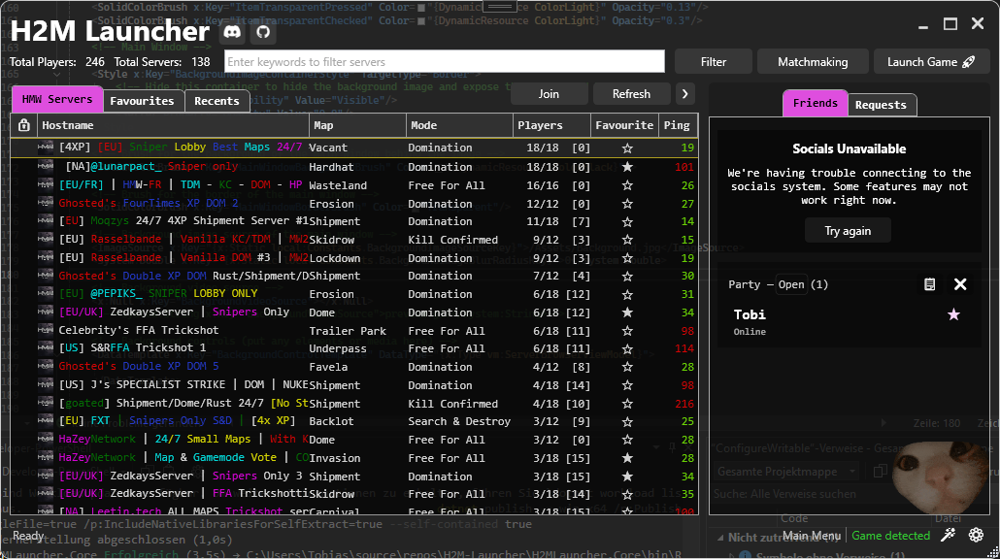

# Theming

Besides the user customization options available in the customization settings, the launcher supports full [WPF XAML](https://learn.microsoft.com/en-us/dotnet/desktop/wpf/xaml/) themes.

This document will guide you through what you can do with this theming system.

**Table of Contents**

- [Theme File](#-theme-file-xaml)
- [Color Palettes](#-color-palettes)
- [Brushes](#️-brushes)
- [Customizing the Background](#customizing-the-background)
- [Customizing specific controls](#customizing-specific-controls)
- [Custom Functional Elements](#custom-functional-elements)
- **[Creating a Theme Pack](#creating-a-theme-pack)**



## 📄 Theme File (XAML)

The theming system works by loading a **custom XAML file** that overrides any resources defined in the default theme. As for today, this includes **colors**, **brushes**, **styles** for some controls and **background image / video**. 

> *If you want us to support customization of a specific control not available yet, feel free to open an issue.*

- When creating such a theme file, you only need to redefine the resources you want to customize. Everything else will be taken from the default theme.

- Most resources in the default theme are defined with a key (i.e. `x:Key="TextDark"`) referenced by the UI. Make sure to include that key in resources you want to override.

The following files might be useful:

- **Default Theme**: [`GlobalResources.xaml`](../H2MLauncher.UI/GlobalResources.xaml) contains all the customizable resources of the launcher. Use that to copy resources you want to customize in your theme.
- **Examples**: [`ThemingExample.xaml`](ThemingExample.xaml) is an example theme file that contains examples for different things you can do with the theming system.


### Loading Theme Files

Theme files can be loaded in the **Customization Settings** (wand icon on the bottom right) of the launcher by opening them in the **Custom Theme** selection. 

Note that this is only really intended for testing and creating themes, as the files are not imported like theme packs. Also, this will override any theme pack selected.

**To create a real theme pack, see [Creating a Theme Pack](#creating-a-theme-pack).**


> **Tip:** When working on a theme file, activate the `Enable Hot Reload` option to see your changes live (can lead to crashes if there are serious errors).
> 
>  Also, some changes might need a restart to apply correctly.


Next, we will describe the resources in detail and how to customize them.

## 🎨 Color Palettes

The launcher defines three different sets of color palettes and two contrast colors to ensure visual consistency. 

Our color palettes are designed to work as a system, not just as a bunch of individual color values. Each palettee includes a range of shades from very light (100) to very dark (900 or 950).

You can find all color definitions at the top of the default theme or [in the example theme](ThemingExample.xaml#L11).

### ⚫⚪ Contrast Colors

Just Black and White. Used mostly for text, backgrounds, and overlays where maximum contrast is needed.

| Name       | Color  | Swatch |
|------------|--------|--------|
| ColorLight | White  | <span style="background-color:White; padding: 4px 40px; border: 1px solid #ccc;"></span> |
| ColorBlack | Black  | <span style="background-color:Black; color: white; padding: 4px 40px; border: 1px solid #ccc;"></span> |


### Neutral Color Palette

The Neutral Palette provides a range of grays from very light to very dark. These colors are primarily used for backgrounds, borders, controls, and text.

| Shade | Color      | Swatch |
|-------|------------|--------|
| 50    | GhostWhite | <span style="background-color:GhostWhite; padding: 4px 40px; border: 1px solid #ccc;"></span> |
| 100   | #e7e7e7  | <span style="background-color:#e7e7e7; padding: 4px 40px; border: 1px solid #ccc;"></span> |
| 200   | LightGray  | <span style="background-color:#d3d3d3; padding: 4px 40px; border: 1px solid #ccc;"></span> |
| 250   | #cccccc  | <span style="background-color:#cccccc; padding: 4px 40px; border: 1px solid #ccc;"></span> |
| 300   | DarkGray   | <span style="background-color:#a9a9a9; padding: 4px 40px; border: 1px solid #ccc;"></span> |
| 400   | #888888  | <span style="background-color:#888888; color: white; padding: 4px 40px; border: 1px solid #ccc;"></span> |
| 500   | #6d6d6d  | <span style="background-color:#6d6d6d; color: white; padding: 4px 40px; border: 1px solid #ccc;"></span> |
| 600   | #444       | <span style="background-color:#444; color: white; padding: 4px 40px; border: 1px solid #ccc;"></span> |
| 700   | #373737  | <span style="background-color:#373737; color: white; padding: 4px 40px; border: 1px solid #ccc;"></span> |
| 800   | #262626  | <span style="background-color:#262626; color: white; padding: 4px 40px; border: 1px solid #ccc;"></span> |
| 900   | #171717  | <span style="background-color:#171717; color: white; padding: 4px 40px; border: 1px solid #ccc;"></span> |
| 950   | #0a0a0a  | <span style="background-color:#0a0a0a; color: white; padding: 4px 40px; border: 1px solid #ccc;"></span> |

### 🟠 Primary Color Palette

The Primary Palette contains colors that define the main accent of the launcher. These colors are used for interactive elements that should stand out like some buttons, tab items, and active states.

| Shade | Color       | Swatch |
|-------|-------------|--------|
| 100   | #ffd1a5   | <span style="background-color:#ffd1a5; padding: 4px 40px; border: 1px solid #ccc;"></span> |
| 200   | #fdba74   | <span style="background-color:#fdba74; padding: 4px 40px; border: 1px solid #ccc;"></span> |
| 300   | Orange      | <span style="background-color:Orange; padding: 4px 40px; border: 1px solid #ccc;"></span> |
| 400   | #E59400   | <span style="background-color:#E59400; padding: 4px 40px; border: 1px solid #ccc;"></span> |
| 500   | DarkOrange  | <span style="background-color:DarkOrange; padding: 4px 40px; border: 1px solid #ccc;"></span> |
| 600   | OrangeRed   | <span style="background-color:OrangeRed; color: white; padding: 4px 40px; border: 1px solid #ccc;"></span> |
| 700   | #cc2f02   | <span style="background-color:#cc2f02; color: white; padding: 4px 40px; border: 1px solid #ccc;"></span> |
| 800   | #a1250b   | <span style="background-color:#a1250b; color: white; padding: 4px 40px; border: 1px solid #ccc;"></span> |
| 900   | DarkRed     | <span style="background-color:DarkRed; color: white; padding: 4px 40px; border: 1px solid #ccc;"></span> |
| 950   | #460d04   | <span style="background-color:#460d04; color: white; padding: 4px 40px; border: 1px solid #ccc;"></span> |

### 🟢 Secondary Color Palette

The Secondary Palette complements the main accent colors and is used very sparingly to highlight elements, like selection boxes.

| Shade | Color       | Swatch |
|-------|-------------|--------|
| 100   | #c9ffc4   | <span style="background-color:#c9ffc4; padding: 4px 40px; border: 1px solid #ccc;"></span> |
| 200   | #98ff90   | <span style="background-color:#98ff90; padding: 4px 40px; border: 1px solid #ccc;"></span> |
| 300   | #56ff50   | <span style="background-color:#56ff50; padding: 4px 40px; border: 1px solid #ccc;"></span> |
| 400   | #00ff00   | <span style="background-color:#00ff00; padding: 4px 40px; border: 1px solid #ccc;"></span> |
| 500   | #7cfc00   | <span style="background-color:#7cfc00; padding: 4px 40px; border: 1px solid #ccc;"></span> |
| 600   | #32CD32   | <span style="background-color:#32CD32; padding: 4px 40px; border: 1px solid #ccc;"></span> |
| 700   | #008b07   | <span style="background-color:#008b07; color: white; padding: 4px 40px; border: 1px solid #ccc;"></span> |
| 800   | #076d0d   | <span style="background-color:#076d0d; color: white; padding: 4px 40px; border: 1px solid #ccc;"></span> |
| 900   | #0b5c11   | <span style="background-color:#0b5c11; color: white; padding: 4px 40px; border: 1px solid #ccc;"></span> |
| 950   | #003406   | <span style="background-color:#003406; color: white; padding: 4px 40px; border: 1px solid #ccc;"></span> |

### Tips for customizing colors

- Don't change just one color. Adjust the full palette when customizing.
- Keep colors consistent. Use the same palette for the same purpose across the app.
- Use palettes by role, not by appearance. Just because two colors "look similar" doesn’t mean they can be swapped.
- [This website](https://uicolors.app/generate) might be useful to generate color palettes as a starting point.


Common mistakes and what to do instead:

#### ❌ “I just want to change the button color, so I’ll update ColorPrimary500.”

**Why this is a problem:**

That color might also be used for hover states, icons, or even text. Changing it without updating the rest of the palette can make the UI look mismatched or unreadable.

**✅ What to do instead:**

If you want to change the main color, update the whole primary palette (100 to 950) to keep a consistent feel across different states (hover, active, disabled).

## 🖌️ Brushes

With WPF, colors cannot be used directly by elements. Instead, a brush needs to be defined that uses colors. There are [different types of brushes available in WPF](https://learn.microsoft.com/en-us/dotnet/desktop/wpf/graphics-multimedia/wpf-brushes-overview), ranging from solid colors with an opacity, to gradients or even images.

The launcher defines a set of brushes for each color palette, + additional brushes used for specific elements like text, borders or dialogs:

```xml
<!-- Text Brushes -->
<SolidColorBrush x:Key="TextDark" Color="{DynamicResource ColorBlack}" />
<SolidColorBrush x:Key="TextLight" Color="{DynamicResource ColorLight}" />
<SolidColorBrush x:Key="TextHint" Color="{DynamicResource ColorNeutral300}" />

<!-- Primary Brushes -->
<SolidColorBrush x:Key="BrushPrimary100" Color="{DynamicResource ColorPrimary100}" />
<SolidColorBrush x:Key="BrushPrimary200" Color="{DynamicResource ColorPrimary200}" />
...
<SolidColorBrush x:Key="BrushPrimary950" Color="{DynamicResource ColorPrimary950}" />

<!-- Dialog Brushes -->
<SolidColorBrush x:Key="DialogBackground" Color="{DynamicResource ColorBlack}" />
<SolidColorBrush x:Key="DialogBorderBrush" Color="{DynamicResource ColorNeutral50}" />

```

### Transparent Brushes

There also is a set of **TransparentDark** and **TransparentLight** brushes based on the contrast colors that provide "shades" of transparency:

```xml
<!-- Transparent Dark Brushes -->
<SolidColorBrush x:Key="TransparentDark100" Color="{DynamicResource ColorBlack}" Opacity="0.1"/>
<SolidColorBrush x:Key="TransparentDark200" Color="{DynamicResource ColorBlack}" Opacity="0.2"/>
<SolidColorBrush x:Key="TransparentDark300" Color="{DynamicResource ColorBlack}" Opacity="0.3"/>
...

<!-- Transparent White Brushes -->
<SolidColorBrush x:Key="TransparentLight100" Color="{DynamicResource ColorLight}" Opacity="0.1"/>
<SolidColorBrush x:Key="TransparentLight200" Color="{DynamicResource ColorLight}" Opacity="0.2"/>
...
```

### ⚠️ Important For Customizing Colors and Brushes
**Due to the way that the WPF resource system works, you need to make sure to redefine every brush of the default theme that uses a color you redefined.**

Example:

```xml
<Color x:Key="ColorLight">Yellow</Color>

<!-- Redefine all brushes that use 'ColorLight' -->

<SolidColorBrush x:Key="TextLight" Color="{DynamicResource ColorLight}" />

<!-- Transparent Item Brushes -->
<SolidColorBrush x:Key="ItemTransparentHover" Color="{DynamicResource ColorLight}" Opacity="0.07"/>
<SolidColorBrush x:Key="ItemTransparentPressed" Color="{DynamicResource ColorLight}" Opacity="0.13"/>
<SolidColorBrush x:Key="ItemTransparentChecked" Color="{DynamicResource ColorLight}" Opacity="0.3"/>

<!-- Transparent White Brushes -->
<SolidColorBrush x:Key="TransparentLight100" Color="{DynamicResource ColorLight}" Opacity="0.1"/>
...
```

> To make this easier, we recommend to always copy **all** brushes from the default theme, **if** you want to adjust any of the predefined color palettes.
>
> If you just want to style an element or add your own color, keep it simple.


## Customizing the Background

Since the main canvas of our launcher is the background of the main window, we provide extensive customization options for that for themes.

The background consists of several layers you can change the appearance of and even put your custom elements like gifs there.

The bottom most layer is the background brush of the main window. In the default theme this is set to a solid black color:

```xml
<!-- Brush for the background of the main window behind the image -->
<SolidColorBrush x:Key="MainWindowBackgroundBrush" Color="{DynamicResource ColorBlack}"/>
```

After that the container that holds the background image or video follows, which can be styled like this:
```xml
<Style x:Key="BackgroundImageContainerStyle" TargetType="Border">
    <!-- Hide this container to hide the background image / video and expose the background brush -->
    <Setter Property="Visibility" Value="Visible"/>
    <Setter Property="Opacity" Value="0.8"/>
</Style>
```

You can override the user-defined background image or video by including the corresponding file in your theme pack and defining the source like this:

```xml
<!-- Background image (set to relative path in theme pack) -->
<ImageSource x:Key="BackgroundImageSource">background.jpg</ImageSource>
```

```xml
<!-- Background video source (set to relative path in theme pack) -->
<system:String x:Key="BackgroundVideoSource">video.mp4</system:String>
```

> Note that the video always sits on top of the image, so users can still override the themes background image by settings their own video.
> 
> You can hide the users background video or override the background blur in your theme (see the [`ThemingExample.xaml`](ThemingExample.xaml) for more.)

### Customizing specific controls

Sometimes you only want to change the appearance of a single element. Therefore we extracted styles for the main elements, like the server list, tabs or social panel.

Customize an element by copying it's `Style` from the default theme and change any parameters:

```xml
<!-- Server List -->
<Style x:Key="ServerDataGridStyle" TargetType="DataGrid">
    <Setter Property="RowBackground" Value="Transparent"/>

    <!-- Change the background brush to something more transparent -->
    <Setter Property="Background" Value="{DynamicResource TransparentDark700}"/>
    <Setter Property="Opacity" Value="0.9"/>
    <Setter Property="BorderThickness" Value="0"/>
</Style>
```

or:

```xml
<!-- Social Panel Tabs -->
<Style x:Key="SocialTabControlStyle" TargetType="TabControl">
    <Setter Property="Background" Value="{DynamicResource TransparentDark400}"/>

    <!-- Change the border brush to something custom -->
    <Setter Property="BorderBrush" Value="{DynamicResource MyCustomBorderBrush}"/>
    <Setter Property="BorderThickness" Value="1"/>
    <Style.Resources>
        <Style TargetType="{x:Type TabPanel}">
            <!-- Center tabs -->
            <Setter Property="HorizontalAlignment" Value="Center" />
        </Style>
    </Style.Resources>
</Style>
```

> *Again, if you want us to support customization of a specific control not available yet, feel free to open an issue or post a suggestion on our Discord.*


### Custom Functional Elements

In addition to the background colors and media, there is a container above where you can put actual functional elements (like GIFs or text) by specifying the template:

```xml
<!-- Background controls (put any elements or media here) -->
<DataTemplate x:Key="BackgroundControlTemplate" DataType="{x:Type vm:ServerBrowserViewModel}">
    <Grid>
        <!-- Your custom elements here -->
    </Grid>
</DataTemplate>
```

Inside this template the main view model is available, so you can even make your elements react to the game state (like changing colors when the user is in a match).

See the [`ThemingExample.xaml`](ThemingExample.xaml#L175) for examples on how to do this, and the [`ServerBrowserViewModel`](../H2MLauncher.UI/ViewModels/ServerBrowserViewModel.cs) for properties to bind to.


## Creating a Theme Pack

Theme Packs are a way to provide custom themes with resouces and assets in a single unit. They can be imported and managed from the launcher.

### 📦 Theme Pack Contents

The ZIP file typically includes the following files:

```
theme-pack.zip
├── metadata.json         # Theme metadata (name, author, etc.)
├── theme.xaml            # Style definitions
├── icon.png              # Theme icon
├── background.jpg        # Main background image / video
└── extras/               # Any additional assets
    ├── animation.svg
    └── overlay.png
```

### 1. `metadata.json`
Each theme pack needs a JSON file containing metadata about the theme, like the name, author and an optional description, all displayed inside the launcher when imported.

**Example contents:**
```json
{
  "id": "dark-serenity",
  "name": "Dark Serenity",
  "author": "Jane Doe",
  "description": "A calm, dark theme for focused work."
}
```

### 2. `theme.xaml`

The main XAML file that defines the UI styles, colors, and other visual parameters used by the theme.

*Can also be named `dark-serenity.xaml` or `theme-pack.xaml` in this example.*

Needs to contain a `ResourceDictionary` as the root element (see [`ThemingExample.xaml`](ThemingExample.xaml))

### 3. `icon.png`

A small image that represents your theme visually (thumbnail or icon) used for the theme selection menu.

Recommended size of at least 64x64 pixels.

Format: .png, .jpg, .ico and more (see [WPF Supported Image Formats](https://learn.microsoft.com/en-us/dotnet/desktop/wpf/graphics-multimedia/imaging-overview#wpf-image-formats))

### 4. Background Image / Video (Optional)

Image / video used as a background.

Typical file names: background.png, bg.jpg, video.mp4

### 5. Other Resources (Optional)

Additional files that support the theme, such as gifs or other media.

> **Make sure to include any images and videos used in your .xaml theme and reference them with a relative path.**